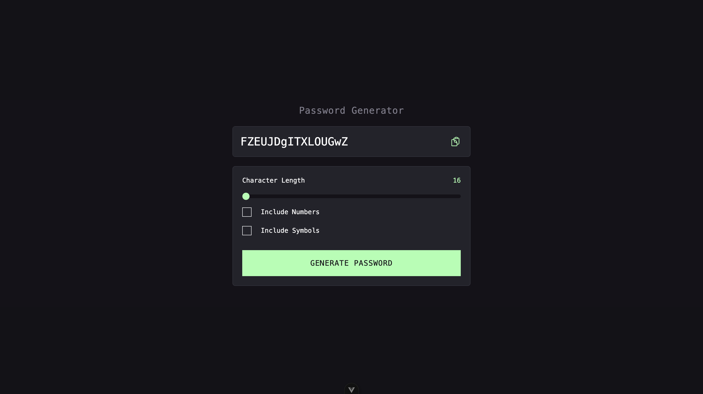

# Password Generator App with Vue.js

This is a simple web application built with Vue.js that utilizes the [Password Generator API](https://api-ninjas.com/api/passwordgenerator) from API Ninjas to generate random passwords.

## Features

- Generate random passwords with specified length and options.
- Copy generated passwords to clipboard.

## Technologies Used

- Vue.js
- Tailwind for styling
- vue-toastification for notifications
- Prettier & ESLint for code formatting

## How to Use

1. Clone this repository to your local machine.
2. Install dependencies using `yarn`.
3. Run the development server using `yarn dev`.
4. Access the application at `http://localhost:5173/`.

## API Usage

To use this application, you need to sign up at [API Ninjas](https://api-ninjas.com/) and get your API key. Then, create a `.env` file in the root directory of the project and add your API key like this:

```
VITE_API_URL = https://api.api-ninjas.com/v1/passwordgenerator
VITE_API_KEY = YOUR_API_KEY

```

## Screenshots



## License

This project is licensed under the MIT License - see the [LICENSE](LICENSE) file for details.